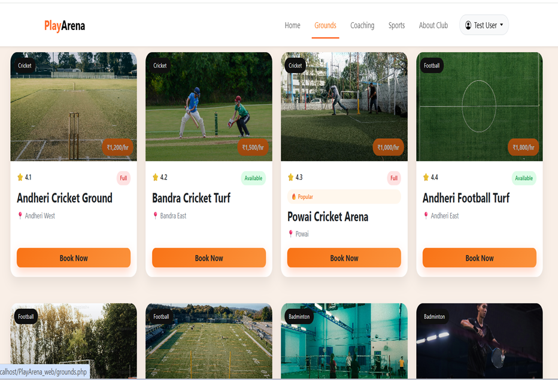
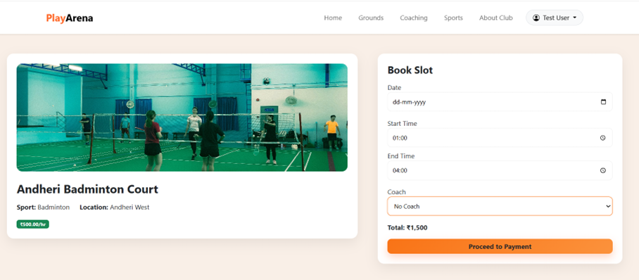
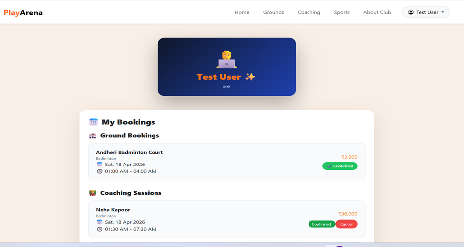
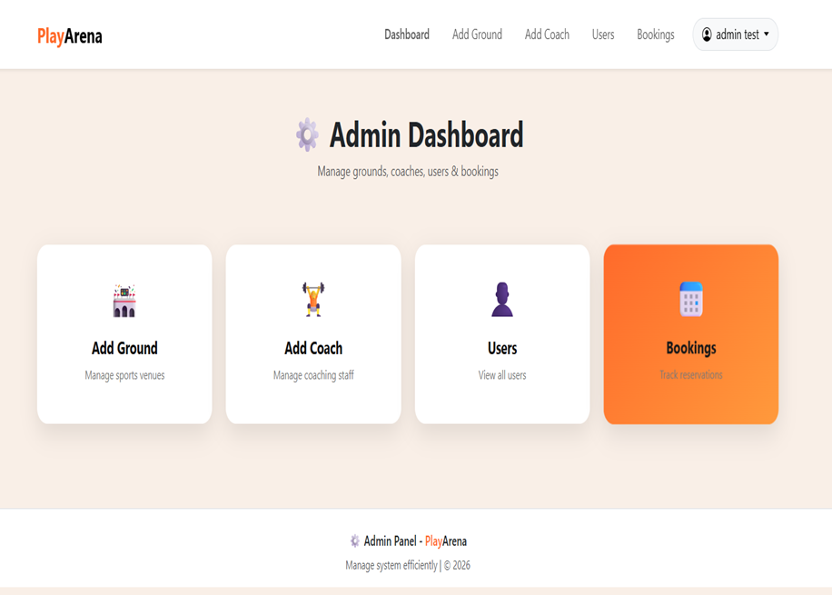

# PlayArena – Sports Club Management System
Academic Full-Stack Web Development Project

PlayArena is a web application developed for managing sports ground bookings and coaching sessions. The system allows users to explore sports facilities, book grounds, enroll in coaching sessions, and manage their bookings through a simple dashboard.

The application also includes an admin panel to manage users, grounds, coaches, and booking records.

---

## Features

### User Side

* User Registration & Login
* Browse Sports Grounds
* Ground Booking System
* Dynamic Price Calculation
* Coaching Session Enrollment
* User Dashboard
* View & Manage Bookings

### Admin Side

* Admin Dashboard
* Add/Edit Grounds
* Add Coaches
* Manage Users
* Track Bookings

---

## Tech Stack

* HTML
* CSS
* JavaScript
* PHP
* MySQL
* XAMPP

---

## Screenshots

### Home Page

### Grounds Booking

### Booking Slot

### User Dashboard

### Admin Dashboard

---

## Project Purpose

This project was developed as part of an academic web development project to gain hands-on experience in full-stack application development, database handling, and booking management workflows.

---

## Future Improvements

* Online Payment Integration
* Email Notifications
* Mobile Responsive Design
* Real-Time Slot Availability

---

## Author

Ishita Boghara
